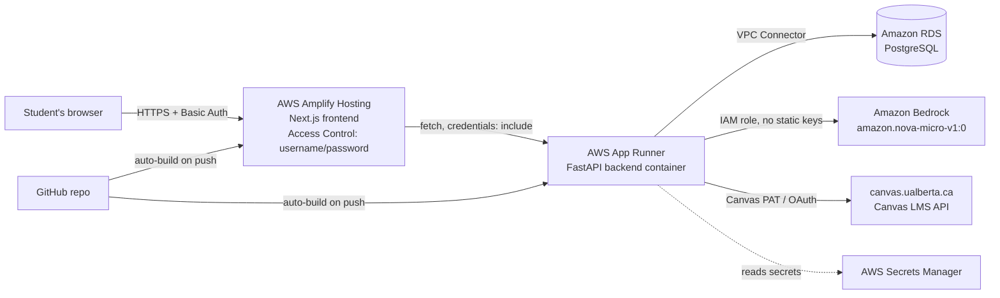

# Deployment Plan (not yet executed)

This is a plan only — nothing described here has been deployed. It picks
concrete AWS services, explains why, and gives a step-by-step runbook for
whoever does the actual deployment. Decisions already made per your answers:
**AWS Amplify** for the frontend (using its built-in username/password
Access Control as the whitelist), and **everything on AWS** (no GitHub
Pages) so frontend and backend share one platform's IAM/secrets/networking
story instead of two.

## Why not GitHub Pages

GitHub Pages only serves static files — no server, no environment
variables at request time, no access control of any kind (you'd need a
separate product like Cloudflare Access in front of it to get a
username/password gate). Amplify Hosting does everything GitHub Pages does
for a Next.js app (git-triggered builds, free HTTPS, a CDN) *plus* the
exact built-in "restrict access with username and password" feature this
project needs, in the same place the backend lives. There's no scenario
here where GitHub Pages wins.

## Architecture



| Layer | Service | Why |
|---|---|---|
| Frontend hosting | **AWS Amplify Hosting** | Native Next.js support, git-triggered CI/CD, free managed HTTPS, and the built-in Access Control (username/password) that *is* the whitelist mechanism you asked for. |
| Backend hosting | **AWS App Runner** | Deploys the existing `backend/Dockerfile` as-is (or builds straight from the GitHub repo — no separate CI pipeline needed). Fully managed HTTPS endpoint, autoscaling, no servers/clusters to run. The serverless-container analog to Amplify, so the whole stack stays "point at a repo, AWS builds and runs it." |
| Database | **Amazon RDS for PostgreSQL** | Matches `postgresql+asyncpg` already in use — zero app code changes. `db.t4g.micro`, single-AZ is enough for this traffic level; can resize later without a migration. |
| Agent model | **Amazon Bedrock** (`amazon.nova-micro-v1:0`, already the default) | Already wired up. In production, App Runner's own **IAM instance role** gets `bedrock:InvokeModel`/`bedrock:Converse` permissions instead of static `AWS_ACCESS_KEY_ID`/`SECRET`. `_build_model()` in `urgency_agent.py` already passes `None` for both when unset, which makes boto3 fall back to the container's IAM role automatically — **no code change needed**, just don't set those two env vars in App Runner. |
| Secrets | **AWS Secrets Manager** | `DATABASE_URL`, `SESSION_SECRET`, `CANVAS_CLIENT_SECRET` (once OAuth is enabled). App Runner injects these as env vars from Secrets Manager references — never baked into the image or committed. |
| Networking | One VPC, RDS in private subnets, App Runner reaches it via a **VPC Connector** | Keeps Postgres off the public internet. Amplify needs no VPC — it's a public static/SSR frontend by design. |
| CI/CD | Amplify's built-in build-on-push; App Runner's built-in build-on-push (source: GitHub) | Both services build directly from the repo on every push to the deploy branch — no GitHub Actions required for the MVP. |
| DNS/TLS | Default `*.amplifyapp.com` / `*.awsapprunner.com` domains, AWS-managed certs | Zero setup, HTTPS out of the box. A custom domain (Route 53 + ACM) is an easy later upgrade, called out below. |

## Whitelisting: what Amplify's Access Control actually covers

Amplify Hosting → your app → **App settings → Access control** → "Restrict
access with username and password" puts an HTTP Basic Auth challenge in
front of the entire Amplify-hosted site (enforced at the CloudFront edge,
per branch) — nobody sees a single page without the shared credentials
first. That's the whitelist.

**Important, so it's not a false sense of security:** this gate lives on
the *frontend's* domain only. The backend (App Runner) is a separate HTTPS
endpoint and Amplify's Basic Auth doesn't extend to it — someone who
discovers the App Runner URL directly bypasses the password gate. In
practice this is bounded by:
- The backend requires a real, working Canvas Personal Access Token to log
  in at all (`/auth/dev-login` calls the real Canvas API and rejects
  invalid tokens) — not something a random visitor has.
- CORS on the backend is locked to `FRONTEND_ORIGIN` (the Amplify domain
  only), which stops other *websites'* JavaScript from calling it, though
  not a direct script/curl call.

If you want the backend itself behind the same gate (defense in depth, or
to stop direct API probing before someone even needs a Canvas token), the
follow-up options are, roughly in order of effort:
1. **Cheapest / fastest:** put AWS WAF in front of App Runner (via an ALB
   or CloudFront distribution) with an IP allowlist or a shared-secret
   header rule.
2. **Most correct long-term:** add an application-level allowlist — a
   table of approved `canvas_user_id`s, checked in `get_current_user` —
   since that's meaningful even if someone has a valid Canvas token but
   isn't someone you want using this deployment.

Neither is implemented in this pass since you specifically chose Amplify's
built-in gate; they're flagged here so the tradeoff is a known, documented
choice rather than an accidental gap.

## Required code/config changes before deploying (see "Cleanup done" below for what's already done)

- `FRONTEND_ORIGIN` (backend) → the Amplify app's URL.
- `NEXT_PUBLIC_API_URL` (frontend build-time env var in Amplify) → the App
  Runner URL.
- `SESSION_COOKIE_SECURE=true` and `SESSION_COOKIE_SAMESITE=none` (backend)
  — Amplify and App Runner are different origins, so the session cookie
  needs `SameSite=None; Secure` or the browser silently drops it after
  login. (Config already added this session — see below.)
- `CANVAS_REDIRECT_URI` → update once/if a real OAuth Developer Key exists
  for this deployment's domain.
- Do **not** set `AWS_ACCESS_KEY_ID`/`AWS_SECRET_ACCESS_KEY` in App Runner —
  grant Bedrock permissions to the App Runner instance role instead (see
  IAM policy below).

## Cleanup done this session (already committed)

- Removed `--reload` from the Docker image's default `CMD` (it's a dev-only
  flag); local hot-reload now comes from a `command:` override in
  `docker-compose.yml` instead, so the image that would actually deploy is
  the production-safe one.
- `SESSION_COOKIE_SECURE` / `SESSION_COOKIE_SAMESITE` are now env-driven
  (`app/config.py`, used in `routers/auth.py`) instead of hardcoded
  `secure=False`, so production can set them correctly without a code change.
- Disabled the Strands agent's default stdout callback handler
  (`callback_handler=None` in `urgency_agent.py`) — it was printing the
  model's full chain-of-thought reasoning to stdout on every request, which
  becomes CloudWatch Logs ingestion cost (and puts students' assignment
  data in plaintext logs) for no benefit in a server context.
- Ran `ruff check --select F,E9` across the backend: no unused imports, no
  syntax errors. No stray `console.log`/`print` debugging, no leftover
  references to removed code (checked after last session's refactor).
- Hardened `.gitignore` (broader `**/__pycache__/`, `**/.venv/`, key/cert
  patterns, editor folders) and initialized the git repo with a clean
  first commit — `.env` confirmed excluded, `.env.example` confirmed to
  contain only placeholders.
- Added `backend/.dockerignore` and `frontend/.dockerignore` — neither
  existed, so `COPY . .` in both Dockerfiles was pulling in whatever
  happened to be on the host (`node_modules/`, `.next/`, `__pycache__/`,
  `.venv/`) if present. This was already silently inflating local build
  context transfer time (~877KB/86s → 63KB/0.7s for the frontend after the
  fix) and, in production, could have shipped a stale/wrong-platform
  `node_modules` or `.venv` into the image.
- Added `amplify.yml` at the repo root (Amplify monorepo build spec,
  `appRoot: frontend`) so connecting the repo in the Amplify Console picks
  up the right build commands without hand-configuration.
- Clarified in both Dockerfiles which one is the real deployment artifact:
  `backend/Dockerfile` is (built → pushed to ECR → run by App Runner), so
  it stays production-correct; `frontend/Dockerfile` is local-dev-only
  (Amplify builds the frontend directly from source, never touching this
  file) and is explicitly commented as such rather than over-engineered
  into a second, unused production build path.
- Full 80-test backend suite still green after all of the above; local
  `docker compose up` re-verified working end-to-end.

## IAM policy for the App Runner instance role (Bedrock access)

```json
{
  "Version": "2012-10-17",
  "Statement": [
    {
      "Effect": "Allow",
      "Action": ["bedrock:InvokeModel", "bedrock:Converse"],
      "Resource": "arn:aws:bedrock:*::foundation-model/amazon.nova-micro-v1:0"
    }
  ]
}
```

## Step-by-step runbook

See **`AWS_SETUP.md`** for the full click-by-click / command-by-command
guide, service by service: IAM (Bedrock instance role), ECR (build/push the
backend image — App Runner deploys from a container image, not by building
the Dockerfile itself, since its source-based deploys only support managed
buildpack runtimes, not custom Dockerfiles), RDS, Secrets Manager, the VPC
Connector, App Runner, and Amplify (including the monorepo app-root setting
and the Access Control whitelist), ending with a cross-wiring step and a
verification checklist. `amplify.yml` at the repo root already configures
Amplify's monorepo build for the `frontend/` app.

## Rough monthly cost (low-traffic prototype, us-east-1)

| Item | Est. cost |
|---|---|
| Amplify Hosting (build minutes + hosting) | ~$0–5 (mostly within free tier at this scale) |
| App Runner (0.25 vCPU / 0.5GB, low request volume) | ~$5–15 |
| RDS `db.t4g.micro` + 20GB gp3 | ~$13–15 |
| Secrets Manager (2–3 secrets) | ~$1–1.50 |
| Bedrock (`amazon.nova-micro-v1:0`, pay-per-token) | Usually well under $5 for prototype-level usage |
| **Total** | **roughly $20–40/month** |

Real driver of variance is App Runner's minimum active-instance billing
and Bedrock token volume if usage grows — both scale with actual traffic,
not fixed costs.

## Explicitly out of scope for this plan (follow-ups, not blockers)

- **Alembic migrations.** Schema changes today mean a manual `ALTER TABLE`
  or dropping the dev DB (see README "Known limitations") — fine for a
  single prototype deployment, but add real migrations before this holds
  data you can't afford to lose across a schema change.
- **Custom domain.** Using a real domain (e.g. `app.example.com` /
  `api.example.com` under one Route 53 hosted zone) would let the session
  cookie use `SameSite=Lax` with a shared parent domain instead of
  `SameSite=None`, which is the more standard production setup — not
  required to function, just cleaner. Optional upgrade.
- **Backend-side hardening** (WAF/IP allowlist or an application-level
  user allowlist) — see the whitelisting section above.
- **CloudWatch alarms / AWS Budget alerts** — worth setting up before
  leaving this running unattended, especially given Bedrock's pay-per-use
  billing.
- **Real Canvas OAuth** — still gated on UAlberta issuing a Developer Key
  (see README); the PAT login path is what this plan deploys.
